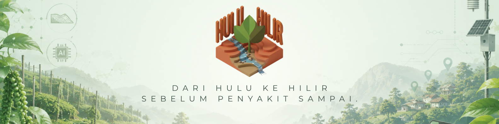

<p align="center">
  
</p>

# HuluHilir

**Terrain-aware agentic early warning for Phytophthora foot rot in Sarawak black pepper.**

*AI Code Competition 2026 (AICC) · SAIC · Track 3, Category B · Finalist*
Team **SMILING FACE WITH SUNGLASSES** — Nathan Yap Jia De (technical) · Zoe Tan An Xuen (deliverables) · Abraham Pang Exin (project management)

---

## The problem

Existing plant-disease tools answer *"what is wrong with this leaf?"* A farmer with foot rot in one block already knows something is wrong. What they cannot see is **where it goes next, and when.**

Phytophthora foot rot does not spread continuously. It travels **downhill through water, in rain pulses.** A vine 40 metres downslope is at real risk after the next heavy rain; a vine 40 metres uphill is not. That asymmetry is invisible on a map and invisible to a single-leaf classifier.

## What HuluHilir does

It models the farm as a **directed elevation graph** and arbitrates between four signals that routinely disagree:

| Signal | Says |
|---|---|
| Diagnosis (CNN) | "Collar lesion, moderate — treat now" |
| Knowledge rules | "This fungicide is rain-fast in 24 h" |
| Weather | "46 mm of rain tomorrow" |
| Spread model | "Downslope block at risk in 4 days" |

Naively, that is four conflicting instructions. HuluHilir's agent resolves them into **one action, one time, one reason:**

> *"Clear the drain today. Spray Thursday morning."*

Spraying today would wash the treatment off before it binds. That arbitration — not the choice of framework — is the differentiator.

---

## Architecture

```
L0  Voice & language   speech templates · voice labels · NO speech recognition
L1  Diagnosis          MobileNetV3-Small, 6 classes, ONNX
L2  Spread             deterministic directed elevation graph — NOT machine learning
L3  Knowledge          JSON rules (authoritative) + retrieval (explanatory only)
L4  Agent              Google ADK root agent + 2 loop agents + 1 advisor
```

### Agent topology

```
RootAgent (LlmAgent) — router + arbitrator
├── FunctionTools (deterministic)
│     diagnose_leaf · get_weather · compute_spread
│     get_treatment · find_spray_window
├── FunctionTools (LLM-backed)
│     explain_why · draft_alert
├── AgentTool → SetupCoordinator      (LoopAgent, max_iterations=25)
├── AgentTool → DiagnosisCoordinator  (LoopAgent, max_iterations=30)
└── AgentTool → Advisor               (LlmAgent + retrieval, non-loop)
```

Loop-termination checks are **deterministic Python querying the database**, never LLM judgement. The model chooses which template to speak; it never decides whether a cycle is complete.

---

## Stack

| Layer | Technology |
|---|---|
| Frontend | Flutter (Dart) — Android APK |
| Backend | FastAPI (Python 3.11+), Pydantic v2 |
| Agent | Google ADK + LiteLLM |
| LLM | **Local:** Ollama (`qwen2.5:14b`) · **Cloud:** Vertex AI (`gemini-2.5-flash`) |
| Storage | SQLAlchemy 2.0 async + SQLite (`aiosqlite`) |
| Diagnosis | MobileNetV3-Small → ONNX, 6 classes, macro F1 **0.934** on held-out data (see caveat below) |
| 3D terrain | Three.js in an embedded WebView, IDW height field |
| Deploy | **Local:** Docker Compose · **Cloud:** Cloud Run + Vertex AI |

Switching between local and cloud is **configuration only** — `API_BASE_URL`, `LITELLM_MODEL`, `DATABASE_URL`. No application code branches on deployment target.

---

## Design commitments

These are product commitments from the submitted proposal, held even where a shortcut would have been faster.

1. **No speech recognition on the critical path.** Voice labels are stored as audio and replayed, never transcribed.
2. **The rules table is the only source of dose, product, and timing.** Retrieval explains *why*; it never decides *what*.
3. **The farmer's elevation answer always overrides sensors.** Conflicts are logged, never auto-resolved against the farmer.
4. **No land boundaries or ownership are recorded** — only `elevation_rank` ordering. NCR land is legally sensitive in Sarawak.
5. **Neighbour alerts are drafted, never auto-sent.** Only a risk band is ever stored against another farmer's block.
6. **The app works with zero photographs taken.** Rain-pulse warnings and the advisor run without any diagnosis cycle existing.
7. **Every user-facing string has a `speech_template_id`.** Literacy is not assumed.
8. **Every risk number carries `is_estimate: true`.** The spread model is physically motivated, not field-validated.

---

## Live deployment

| | |
|---|---|
| **Landing page + app** | **https://sfws-aicc-workspace-1.web.app** |
| App directly | https://sfws-aicc-workspace-1.web.app/app/ |
| API | https://huluhilir-api-mfrzixfqeq-as.a.run.app |
| Interactive docs | [`/docs`](https://huluhilir-api-mfrzixfqeq-as.a.run.app/docs) |
| Readiness + seed state | [`/health/ready`](https://huluhilir-api-mfrzixfqeq-as.a.run.app/health/ready) |

Open the app and tap **"Lihat ladang demo"** to reach the dashboard without walking a farm.

Cloud Run (`asia-southeast1`) · Vertex AI `gemini-2.5-flash` · Cloud SQL Postgres · Google Cloud TTS · Firebase Hosting.
Authentication throughout is the service's own service account — there is no API key in this repository or in its configuration.

---

## Running it

### Backend (local)

```bash
docker compose up --build
```

Ollama runs natively on the host, not in Docker:

```bash
ollama serve && ollama pull qwen2.5:14b
```

### Flutter app

```bash
cd flutter_app
flutter run --dart-define=API_BASE_URL=http://<LAPTOP_LAN_IP>:8000
```

### Tests

```bash
cd backend && pytest
```

The arbitration test (`tests/test_agent_arbitration.py`) runs against a **live** LLM rather than a mock — it is the exit criterion for the agent layer, and mocking it would only prove the mock.

---

## Repository layout

```
backend/          FastAPI app, agent layer, deterministic tools, tests
  app/agent/        ADK agents, tool bindings, error boundaries
  app/tools/        spread · weather · treatment · diagnose · graph · advisor
  app/routers/      HTTP surface
  seed/             rules table, knowledge docs, speech templates, demo farm
classifier/       MobileNetV3-Small training + exported ONNX model
flutter_app/      Android client
  assets/terrain/   Three.js 3D terrain scene
docs/             specification, data model, build log, validation checklist
```

`docs/BUILD_LOG.md` records what broke during the build and how it was diagnosed, including the failures that were only visible on a real device.

---

## Status

Built during a 24-hour window (23–24 Aug 2026) on-site at TDV Kuching.

The demo farm is synthetic (a placeholder near Kuching) so the pipeline is demonstrable; the spread model is physically motivated but **not field-validated**, which is why every risk figure it emits is flagged as an estimate.

**On the classifier's 0.934 macro F1.** That is a real measurement of the MobileNetV3-Small on its own held-out test set, and nothing more. Probing the exported model shows it confidently wrong on inputs it should reject outright — a solid black image returns `healthy_leaf` at 0.78 — and every plausible preprocessing variant reproduces that, which locates the problem in the weights rather than the wiring. It was trained on roughly 530 originals, largely generated rather than photographed. **It does not generalise to real field photos, and the 0.934 should not be read as field accuracy.** L1 is therefore presented as an early-warning prompt to go and inspect a vine, never as a diagnosis. A vision-model backend exists behind `CLASSIFIER_BACKEND` as the intended replacement; it is not yet working and the deployed path remains the CNN.

## Licence

Competition submission. Not licensed for production agricultural decision-making.
