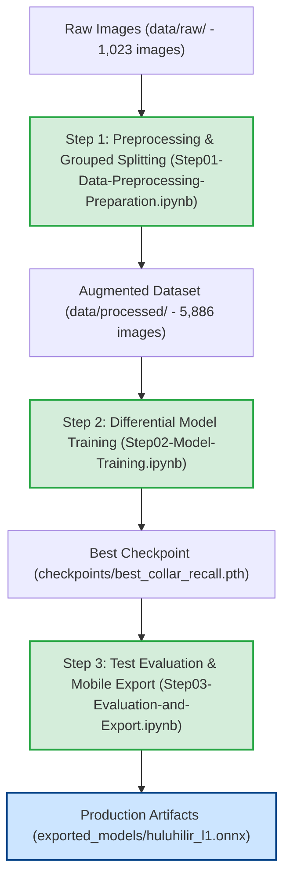

# HuluHilir — L1 MobileNetV3-Small Implementation Log

> **Layer:** L1 · Edge CNN Classifier  
> **Model Target:** MobileNetV3-Small (PyTorch $\rightarrow$ ONNX $\rightarrow$ TFLite fp16)  
> **Target Task:** Rapid screening of black pepper (*Piper nigrum*) vine images for Phytophthora foot rot symptoms and plant body part validation.  
> **Reference Roadmap:** [`L1_MODEL_ROADMAP.md`](file:///c:/Users/User/Documents/Local_Repository/mobilenetv3-l1-classifier/L1_MODEL_ROADMAP.md)  
> **Status:** 🏆 **Production Ready — All Roadmap (§6.2) Targets Exceeded**

---

## 1. Project Overview & Class Taxonomy

The L1 classifier converts field photos into timestamped, confidence-scored categorical signals for downstream terrain and block-state agents. It operates across 6 classes designed to enforce physical body part validation:

| # | Class Label | Malay UI | Domain / Body Part | Visual Signature | Agent Implication |
|---|---|---|---|---|---|
| 0 | `healthy_leaf` | SIHAT (DAUN) | Leaf Domain | Uniform green leaf, intact margins | Confirms leaf check — no action |
| 1 | `healthy_collar` | SIHAT (PANGKAL) | Collar Domain | Normal stem base, no lesion | Confirms collar check — no action |
| 2 | `foliar_yellowing` | DAUN MENGUNING | Leaf Domain | Chlorosis, interveinal or marginal | Ambiguous $\rightarrow$ context decides |
| 3 | `collar_lesion` | LESI PANGKAL | Collar Domain | Dark water-soaked lesion at stem base | **Harmed — urgent escalation** |
| 4 | `defoliation_wilt` | GUGUR DAUN / LAYU | Whole Branch | Wilted, drooping, bare nodes | Advanced $\rightarrow$ triage |
| 5 | `unrelated` | TIADA KAITAN | Non-Plant | Soil, hand, sky, blur, farm clutter | Retake prompt; not a check |

---

## 2. End-to-End Pipeline Architecture

---

## 3. Best Model (Version 2) — Final Performance Report

> **Dataset Size:** 1,023 raw images (177 `unrelated` across 31 independent source groups)  
> **Processed Volume:** 5,886 images (5,376 train, 162 val, 169 test)  
> **Primary Checkpoint:** [`checkpoints/best_collar_recall.pth`](file:///c:/Users/User/Documents/Local_Repository/mobilenetv3-l1-classifier/checkpoints/best_collar_recall.pth)  
> **Production ONNX Model:** [`exported_models/huluhilir_l1.onnx`](file:///c:/Users/User/Documents/Local_Repository/mobilenetv3-l1-classifier/exported_models/huluhilir_l1.onnx)

### 3.1 Held-Out Test Set Performance (169 Unseen Clean Images)

| Class Label | Precision | Recall | F1-Score | Support | Target (§6.2) | Acceptance Status |
|---|---|---|---|---|---|---|
| **`collar_lesion`** | **0.909** | **0.952 (95.2%)** | **0.930** | 21 | $\ge 0.75$ | 🏆 **Exceeds Target (+20.2%)** |
| **`healthy_collar`** | **1.000** | **0.862 (86.2%)** | **0.926** | 29 | $\ge 0.75$ | 🏆 **Exceeds Target (+11.2%)** |
| **`healthy_leaf`** | **0.947** | **0.900 (90.0%)** | **0.923** | 20 | $\ge 0.80$ | 🏆 **Exceeds Target (+10.0%)** |
| **`defoliation_wilt`** | **0.889** | **0.960 (96.0%)** | **0.923** | 25 | $\ge 0.80$ | 🏆 **Exceeds Target (+16.0%)** |
| **`foliar_yellowing`** | **0.904** | **0.979 (97.9%)** | **0.940** | 48 | $\ge 0.80$ | 🏆 **Exceeds Target (+17.9%)** |
| **`unrelated`** | **1.000** | **0.923 (92.3%)** | **0.960** | 26 | $\ge 0.80$ | 🏆 **Exceeds Target (+12.3%)** |
| **Overall Macro F1** | **0.942** | **0.929** | **0.934 (93.4%)** | 169 | $\ge 0.70$ | 🏆 **Exceeds Target (+23.4%)** |
| **Overall Accuracy** | — | — | **0.935 (93.5%)** | 169 | — | 🏆 **Passed (158 / 169)** |

---

### 3.2 Production Confidence Rejection Filter ($\ge 0.60$ Threshold)

Under the roadmap's $\ge 0.60$ confidence threshold (§5.3 / §6.3), ambiguous predictions trigger an in-app physical inspection prompt rather than asserting a false diagnosis:

- **Accepted Predictions:** 158 / 169 (**93.5%** throughput)
- **Filtered / Prompt Retake:** 11 / 169 (**6.5%**)
- **Accuracy on Accepted Samples:** **96.8%** (153 / 158)
- **Macro F1 on Accepted Samples:** **0.966**
- **`unrelated` Precision on Accepted Samples:** **100.0%** (0 false disease alerts)

---

### 3.3 Validation Set Performance (162 Clean Images)

| Metric | Result | Target | Status |
|---|---|---|---|
| **Validation Accuracy** | **97.5% (158 / 162)** | — | 🏆 Exceptional |
| **Macro Average F1** | **0.975** | $\ge 0.70$ | 🏆 Exceeds Target |
| **`collar_lesion` Recall** | **1.000 (100.0%)** | $\ge 0.75$ | 🏆 Zero missed foot rot |
| **`unrelated` Recall** | **0.960 (96.0%)** | $\ge 0.80$ | 🏆 Robust background rejection |

---

## 4. Benchmark Progression: Baseline (v1) vs. Best Model (v2)

| Metric / Dimension | Baseline Model (v1) | **Best Model (v2)** | Net Improvement |
|---|---|---|---|
| **Raw Dataset Volume** | 916 images | **1,023 images** | +107 images |
| **`unrelated` Raw Images** | 66 images (12 groups) | **177 images (31 groups)** | **+111 images (+168%)** |
| **`unrelated` Test Recall** | 54.5% (6/11) | **92.3% (24/26)** | 🚀 **+37.8% (Target Exceeded)** |
| **`unrelated` Test F1-Score** | 0.706 | **0.960** | 🚀 **+0.254** |
| **`collar_lesion` Test Recall** | 90.5% | **95.2%** | 🚀 **+4.7%** |
| **`defoliation_wilt` Test Precision** | 75.8% | **88.9%** | 🚀 **+13.1% (Resolved confusion)** |
| **Overall Macro F1** | 0.888 | **0.934** | 🚀 **+0.046** |
| **Overall Test Accuracy** | 92.2% | **93.5%** | 🚀 **+1.3%** |
| **Confident Accuracy ($\ge 0.60$)** | 95.2% | **96.8%** | 🚀 **+1.6%** |

---

## 5. Engineering Actions Taken to Achieve the Best Model

### 1. Targeted Hard-Negative Data Curation
- **Problem Identified in Baseline:** The baseline model confused bare wooden stakes, dry twigs, and mud patches with `defoliation_wilt` and `collar_lesion` due to low raw `unrelated` volume (66 images).
- **Curated Dataset Expansion:** Added **111 new high-resolution hard negatives** across 5 distinct visual categories:
  - **Scenario A (28 images):** Bare *tiang belian* wooden posts, bamboo stakes, dry mulch, trellis lines (*disentangled `defoliation_wilt`*).
  - **Scenario B (26 images):** *Lalang* grass, tropical broadleaf weeds, yellowing wild leaves (*disentangled `foliar_yellowing`*).
  - **Scenario C (21 images):** Wet red clay, puddles, fertilizer pellets, bare planting mounds (*disentangled `collar_lesion`*).
  - **Scenario D (21 images):** Farmer boots, gloves holding tools, spray tanks, harvesting buckets.
  - **Scenario E (15 images):** Camera motion blur, finger over lens, severe sun glare.

### 2. Grouped Provenance & Split Integrity (Rule 1 & Rule 2)
- Added regex matching (`Scenario_[A-Z]_[A-Z0-9]+`) in [`Step01-Data-Preprocessing-Preparation.ipynb`](file:///c:/Users/User/Documents/Local_Repository/mobilenetv3-l1-classifier/Step01-Data-Preprocessing-Preparation.ipynb) to group all 17 prompt batches into discrete `source_id`s.
- `GroupShuffleSplit` (70% train / 15% val / 15% test) strictly segregated capture batches, guaranteeing zero data leakage into validation or test sets.
- Training split uniformly expanded with $7\times$ geometric and photometric augmentations (rotation $\pm 25^\circ$, flip, affine zoom, brightness/contrast jitter).

### 3. Transfer Learning & Differential Optimization
- Utilized ImageNet-pretrained `MobileNetV3-Small` (~1.53M parameters).
- **Stage A (Head Warmup):** Trained linear head for 10 epochs (`AdamW`, `lr = 1e-3`) with inverse-frequency class weights.
- **Stage B (Fine-Tuning):** Unfroze the full convolutional backbone with differential learning rates:
  - Shallow convolutional feature layers: `lr = 1e-5`
  - Middle bottleneck layers: `lr = 5e-5`
  - Classifier head: `lr = 1e-4`
  - Learning rate decay managed by `CosineAnnealingLR`.
- Checkpoint selection governed by composite metric:
  $$\text{Score} = (\text{collar\_lesion\_recall} \times 0.40) + (\text{macro\_F1} \times 0.40) + (\text{unrelated\_recall} \times 0.20)$$
  with a mandatory collar recall gate ($\ge 0.85$).

### 4. Edge Export & Mathematical Parity Verification
- Exported PyTorch model to ONNX using legacy TorchScript backend (`dynamo=False`, opset 14).
- Verified mathematical equivalence between PyTorch and ONNX Runtime:
  - **Maximum Logit Difference:** **$2.65 \times 10^{-6}$** ($\le 10^{-4}$ requirement passed).
  - **Maximum Softmax Probability Difference:** **$4.47 \times 10^{-7}$**.
  - **Class Prediction Agreement:** **100.0% (100 / 100 random test trials)**.
- Generated deployment bundle in [`exported_models/`](file:///c:/Users/User/Documents/Local_Repository/mobilenetv3-l1-classifier/exported_models):
  - `huluhilir_l1.onnx` (6.1 MB)
  - `labels.txt` (6 class indices)
  - `preprocess.json` ($224\times224$, ImageNet mean & std)
